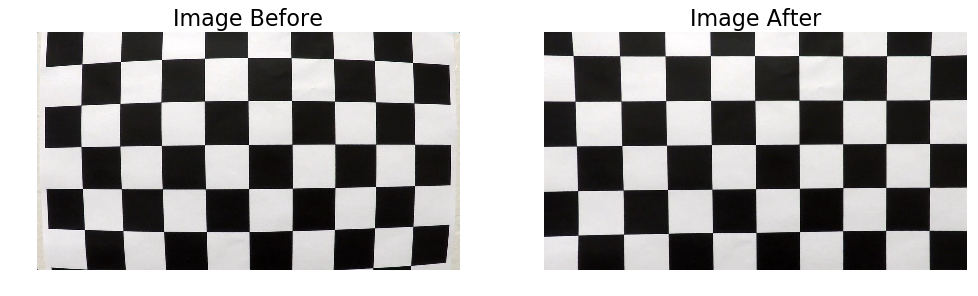

# Advanced Lane Finding Project

The goals / steps of this project are the following:

* Compute the camera calibration matrix and distortion coefficients given a set of chessboard images.
* Apply a distortion correction to raw images.
* Use color transforms, gradients, etc., to create a thresholded binary image.
* Apply a perspective transform to rectify binary image ("birds-eye view").
* Detect lane pixels and fit to find the lane boundary.
* Determine the curvature of the lane and vehicle position with respect to center.
* Warp the detected lane boundaries back onto the original image.
* Output visual display of the lane boundaries and numerical estimation of lane curvature and vehicle position.

---

## Imports and Utility Functions


```python
import numpy as np
import cv2
import matplotlib.pyplot as plt
import pickle
import os
from glob import glob

from utilityfun import *
from lanedetection import *

%load_ext autoreload
%autoreload 2
```

# Lane Finding Pipeline

## Camera Calibration

The first step is do do a camera calibration based on a set of images taken of a chess board at different angles and distances, where the number of squares is known.  OpenCV is capable of detecting the corners of these squares with **`cv2.findChessboardCorners()`**. The chessboard points detected in the image are returned as **`imgpoints`** while the expected, evenly spaced 2D chessboard points are returned in **`objpoints`** as a 3D coordinate matrix.


```python
visualise = False
calibration_files = glob('./camera_cal/calibration*.jpg')

if visualise:
        %matplotlib qt
        
objpoints, imgpoints = calibration_corner_detection(calibration_files, visualise=visualise)
```

From these two, OpenCV is capable of obtaining an approximation of the camera matrix and distortion coefficients with **`cv2.calibrateCamera()`**. Once we have these, it is simple to compensate for a camera's distortion.


```python
# Camera calibration 
img = import_image('./camera_cal/calibration1.jpg')
img_res = (img.shape[1], img.shape[0])
ret, mtx, dist, rvecs, tvecs = cv2.calibrateCamera(objpoints, imgpoints, img_res,None,None)
distortion_obj = {"mtx": mtx, "dist": dist}
```

Below is a preview of the effects of the camera calibration:


```python
%matplotlib inline
udist = cv2.undistort(img, mtx, dist, None, mtx)
compare_images(img, udist)
```





Here we can see the dramatic distortion present in the images before calibration and how much of it was removed with the obtained distortion coefficients and camera matrix. It is not 100% perfect though, which is especially clear in the bottom left corner.

Now let's compare the images while driving:


```python
img = import_image('./test_images/straight_lines1.jpg')
udist = cv2.undistort(img, mtx, dist, None, mtx)
compare_images(img, udist)
```


With the real world images the difference is much more muted, which goes to show how well our perception masks these distortions.  The best place to see the difference is the hood, which is now pulled towards the centre of the frame near the middle.

## Perspective Transform

It was decided to perspective transform the image before doing any of the image processing to accentuate the lane lines, since this automatically restricts the transformations to the area of interest.

To transform the perspective of an image, we simply need four source points and their respective destination points. The perspective of an input image can then be modified to match these onto one another with the OpenCV function **`warpPerspective`**. 

The decision was made to 'compress' the image near to the car as opposed to 'expanding' the lane near the horizon. This has two advantages: the colour gradients for the distant lines remain sharp, since they are not stretched; and secondly, it is easy to plot polynomials onto the image even if these leave the area of interest in sharp corners. A further benefit that was not explored is that one could also take the other lanes into consideration. This idea came after seeing [John Chen's](https://github.com/diyjac/SDC-P5/blob/master/README-PROJECT-DETAILS.md) amazing solution to the project.


```python
src_top_left  = [0.000 * img_res[0], 0.63 * img_res[1]]
src_top_right = [1.000 * img_res[0], 0.63 * img_res[1]]
src_bot_left  = [-3.08 * img_res[0], 0.95 * img_res[1]]
src_bot_right = [4.080 * img_res[0], 0.95 * img_res[1]]

src_points = np.float32([src_top_left, src_top_right, src_bot_left, src_bot_right])
```

Below is an example of a perspective transformed image, so that we obtain a bird's eye view of the road, as if perfectly above. The lane lines pass vertically from the bottom to the top. The points used to achieve this transformation were obtained by trial and error.


```python
img = import_image('./test_images/straight_lines1.jpg')
udist = cv2.undistort(img, mtx, dist, None, mtx)
warped = perspective_transform(udist, src_points)
compare_images(udist, warped, titles=['Undistored Image', 'After Perspective Transformation'])
save_image(warped, name='perspective_transform')
```


## Process Image to Amplify Lane Markings

The next step is to amplify the lane markings so that we can identify them easily.  For that, it makes sense to extract a varied set of information from the image first, to see how best we can use it.

### Analyse colour channels

The first step is to have a closer look at what information is contained within the colour channels.


```python
plot_color_channels(warped, colorspace='RGB')
```

    Note: Input image must be in RGB color space!


When we look at the RGB decomposition, the information contained in each channel is not far off from what we would expect in a grayscale conversion.  Nevertheless, the red channel is more sensitive to the yellow lane marking, which is something we could use later. 


```python
plot_color_channels(warped, colorspace='HLS')
```

    Note: Input image must be in RGB color space!


In the HLS colourspace there are more pronounced differences.  The Hue channel does not have much value, although the saturation channel is quite sensitive to the yellow lane markings.  Here the problem is that the performance can be unpredictable,  In the upper portion of the image  there are wild fluctualtions in the saturation.  

The disturbances are especially strong in the shade, which can have extremely high and low values. It was also found that the saturation for white lane markings could be quite unpredictable with either very high or very low values.

### Gradients

To detect strong colour gradients that can help us identify the near vertical lines we are trying to detect, a sobel filter in x is used.  For lane lines this should result in two peaks along the sides of each lane marking respectively.

We are using the red channel, since we saw before that this contains similar information to the grayscale image, but also accentuates the yellow lane markings.


```python
gradients = abs_sobel(warped[:,:,0], thresh_min=20)
compare_images(img[:,:,0], gradients)
```


The gradient appears to be quite effective at detecting the lane markings. It has a few weaknesses though: it also detects other markings on the road, cars and shadows/road edges; it also creates two 'peaks' on either side of the marking, where the gradients are detected.  This means that they also don't pinpoint the centre of the lane accurately. 

## Image Augmentation

We have seen that there are various techniques to process the input images to accentuate the lane markings.  However, none of these works for all sitations.  To address this, we need to create an ensemble, where the lanes are accentuated, but all other road features and disturbances are reduced.

To detect the lanes, we will limit our search to the central portion of the image. This reduces computational cost and the adverse influences from features outside of this region.

The function **`accentuate_lane_lines()`** takes in the warped image and then performs the following operations in sequence:
 - Get the saturation channel from the HLS colourspace
 - Get the red channel from the RGB colourspace
 - Get the areas in the red channel which have values lower than 50 and invert these (effectively producing a channel containing the 'darkness magnitude')
 - Increase the gamma of the red channel by 2, which is a way of exponentially scaling the light areas relative to the dark areas while staying within the 0-255 range.
 - Apply a sobel gradient filter to the red and saturation channels respectively
 - Add these gratients together
 - Shift the gradient to the left and right by 1/2 a lane width and then combine (this is meant to concentrante the peaks in the centre of the lane and reduce the intensity of gradients created by singe 'edges'.
 - Multiply the red channel by the combined sobel channel, amplifying those areas where they overlap, but not completely removing other bright areas.
 - Perform another gamma increase of 2 on the resulting field.
 - Normalise the result and return it.

Here we can see this accentuation on the supplied test images:


```python
test_image_files = glob('./test_images/*.jpg')

aoi = ((int(0.44 * 1280), int(0.0 * 720)),
       (int(0.57 * 1280), int(1.0 * 720))) #area of interest

for test_image_file in test_image_files:
    test_image = import_image(test_image_file)
    
    udist = cv2.undistort(test_image, mtx, dist, None, mtx)
    warped = perspective_transform(udist, src_points)
    accentuated = np.zeros((warped.shape[0], warped.shape[1]))
    accentuated[aoi[0][1]:aoi[1][1], aoi[0][0]:aoi[1][0]] = accentuate_lane_lines(warped[aoi[0][1]:aoi[1][1], 
                                                                                         aoi[0][0]:aoi[1][0],
                                                                                         :])
    compare_images(warped, accentuated, titles=['Original Warped', 'Accentuated Lane Lines'])
```


Although the result looks adequate for the next steps, there are clear weaknesses on roads with low contrast due to light asphalt and also in areas with shadows cast by trees. in these images we also have the advantage of not having any cars in the lane ahead or any road markings in the centre of the lane.

## Detect Lane Lines

In the next step, the lane lines need to be detected. For this we first subdivide the image into vertical bins. We will then try to detect the lane position for each slice. It was found that 30 bins are a good compromise between resolution and avoiding too many points that could adversely affect the polynomial fitting.


```python
vertical_bins = range(30)
vertical_bins = [int(24 * 1) for b in vertical_bins]
visualise_bins(warped, vertical_bins)
```


Now we need to detect the intensity peaks in the input images. This is done for each side respectively. For the first image in a series, all pixels to the left of the centre of the image are considered for the left lane and all pixels to the right of the centre are considered for the right lane. Once a polynomial exists, it is expected that its shape wont change too dramatically between frames, therefore the search window is reduced to within 15px either side of the existing polynomials respectively.  This has the added advantage of allowing lane lines to cross over the center line in sharp corners. Once the windows of interest move outside of the image, the search windows are fixed at the side of the image.

The peaks are detected by getting the maximum value from the histogram and comparing it to the average over the histogram. Based on this a confidence score is retuned along with the detected peak position.

If less than 6 peaks are detected with a high confidence level, the previous polynomial is reused.

To ensure that the projections are accurate, plot the result on an image below. The dots are colored by confidence level:

| Color | Confidence Level |
|:-----:|:----------------:|
| Green | High |
| Yellow | Medium |
| Orange | Low |
| Red | No Confidence |


```python
left_peaks, right_peaks = detect_lines(accentuated, vertical_bins)

# Create a 3-channel image from grayscale so colourful circles can be plotted on it.
norm_img_color = np.stack((accentuated, accentuated, accentuated), axis=-1)
img_peaks = np.copy(norm_img_color)

def mark_peak(img, peak_info):
    confidence = peak_info[2]
    if confidence == 'high':
        color = (0,255,0)
    elif confidence == 'medium':
        color = (255,255,0)
    elif confidence == 'low':
        color = (255,180,0)
    elif confidence == 'none':
        color = (255,0,0)
        
    return cv2.circle(img, (peak_info[0],peak_info[1]) , 15, color, -1)

for left_peak, right_peak in zip(left_peaks, right_peaks):
    img_peaks = mark_peak(img_peaks, left_peak)
    img_peaks = mark_peak(img_peaks, right_peak)
    
compare_images(accentuated, img_peaks.astype(int), titles=['Accentuated', 'Lane Detections'])
```


## Get Polynomial Approximations of Lanes

A second order polynomial can now be fitted through the points which have a high or medium confidence level.

Below one can see the resulting polynomials and the space in between overlaid on the original image:


```python
left_lane_poly, points_left = get_lane_poly(left_peaks)
right_lane_poly, points_right = get_lane_poly(right_peaks)

overlay_lines, overlay_fill = get_highlighted_lane(left_lane_poly, right_lane_poly, accentuated)
img_with_lanes = overlay_image(warped, overlay_fill, opacity=0.3)
img_with_lanes = overlay_image(img_with_lanes, overlay_lines, opacity=0.7)

plot_image(img_with_lanes, title='Laneline Polynomials')
```


## Get Curvature and Car Position

Convert the polynomial from pixel space to real world dimensions based on an expected lane width of 3.7 meters. The width of the lanes in pixel space is measured and fixed in this case because determining it dynamically was not seen as advantageous and likely to cause errors.

For the scaling in x, it is assumed that the width of the lane is 3.7m and the length of the dashed lines in 3.0m as per US regulations.


```python
pixels_between_lanes = 110
pixels_along_dash = 90

mpp_x = 3.7/pixels_between_lanes #meters per pixel in x-direction
mpp_y = 3.0/pixels_along_dash #meters per pixel in y-direction
```

Transform the polynomial with more datapoints into real world dimensions.  This is expected to be the more reliable result.


```python
coeff_scaling = [mpp_x / (mpp_y ** 2), (mpp_x/mpp_x), 1]

dominant_poly, lane = (left_lane_poly, 'left') if points_left > points_right else (right_lane_poly, 'right')
print('The ' + lane + ' lane has more data points.')
poly_real = [coeff * coeff_scaling[i] for i, coeff in enumerate(dominant_poly)]
```

    The left lane has more data points.


Determine the radius of curvature near the car with the dominant polynomial. The radius is determined from the formula: 

$$R_{curve} = \frac{(1+(2Ay+B)^2)^{3/2}}{|2A|}$$

Where A and B are the polynomial coefficients in:

$$ x = A y^2 + B y + C $$


```python
lane_radius, direction = get_lane_curvature(poly_real, warped.shape[0]*mpp_y)
lane_rad_string = "Radius: " + "{:1.2f}".format(lane_radius) + 'm to the ' + direction   
```

Determine the offset of the car from the center of the road (assuming the camera is mounted perfectly in the center):


```python
car_offset, side = get_car_offset(dominant_poly, lane, warped.shape[0], warped.shape[1], 
                                  pixels_between_lanes, mpp_x)
car_pos_string = "Offset: " + "{:1.2f}".format(car_offset) + 'm to the ' + side 
```

Create an overlay image with the car offset:


```python
overlay_offset = plot_car_offset_lines(warped, car_offset, mpp_x, side)
```

## Visual Output

Convert the overlay back to the original perspective:


```python
# undistort lane detection annotations
overlays = ({'image': overlay_lines,  'opacity': 0.8},
            {'image': overlay_fill,   'opacity': 0.3},
            {'image': overlay_offset, 'opacity': 0.8},)

img_with_overlay = undistort_and_overlay(udist, src_points, overlays)

img_with_overlay = darken_bg(img_with_overlay, img.shape[0] - 40,  img.shape[0], 0, img.shape[1])
img_with_overlay = plot_text(img_with_overlay, lane_rad_string, 'left') 
img_with_overlay = plot_text(img_with_overlay, car_pos_string, 'right')
```

Plot result on the original image including the car's offset from the centre of the lane and the road curvature near the car.


```python
plt.subplots(1, 1, figsize=(20,10), dpi= 150)
plot_image(img_with_overlay.astype(int), title='Processed Image')
```


# Video Feeds - All Together Now

The full pipeline that takes an image or video frame as an input and gives the lane curvature, car position and annotated image as an output.


```python
camera_setup = {'camera_matrix':        mtx
               ,'distortion_coeff':     dist
               ,'pixels_between_lanes': 110
               ,'pixels_along_dash':    90}

timing = {}
timing['image_manipulation'] = 0
timing['annotating_images'] = 0
timing['distortion_correction'] = 0
timing['perspective_transformations'] = 0
timing['polynomial_fitting'] = 0
```

Run pipeline on the test images:


```python
%matplotlib inline

dir = './test_images'
files = os.listdir(dir)

img_files = [dir + '/' + file for file in files if '.jpg' in file]

images = [import_image(image_file) for image_file in img_files]
p_l=None
p_r=None

plt.subplots(4, 2, figsize=(10, 15), dpi= 150)

for index, image in enumerate(images):
    img_name = img_files[index].split('/')[-1]
    img_result, p_l, p_r, timing = get_lane_info(image,
                                                 camera_setup,
                                                 src_points,
                                                 vertical_bins, timing)
    plt.subplot(4, 2, index + 1)
    plot_image(img_result.astype(int), title=img_name)
```


The result looks good for most of the images. The curvature and offset values also look plausible based on the reference dimensions. The accuracy of the polynomial representing the dashed lines is clearly less accurate than the one for the solid yellow line though.

Feed video into pipeline:


```python
import imageio

video_name = 'project_video'

reader = imageio.get_reader(video_name + '.mp4')
fps = reader.get_meta_data()['fps']

video_output = 'output_video/annotated_' + video_name + '.mp4'
writer = imageio.get_writer(video_output, fps=fps)

p_l=None
p_r=None

for image in reader:
    img_result, p_l, p_r, timing = get_lane_info(image, 
                                                 camera_setup, 
                                                 src_points,
                                                 vertical_bins,
                                                 timing, poly_left=p_l, poly_right=p_r)
    writer.append_data(img_result.astype(np.dtype('uint8')))
writer.close()

print('Time spent on image manipulation:', round(timing['image_manipulation'], 1), 'seconds.')
print('Time spent on image annotation:', round(timing['annotating_images'], 1), 'seconds.')
print('Time spent on distortion correction:', round(timing['distortion_correction'], 1), 'seconds.')
print('Time spent on perspective transformations:', round(timing['perspective_transformations'], 1), 'seconds.')
print('Time spent on polynomial fitting:', round(timing['polynomial_fitting'], 1), 'seconds.')
```

    Right
    Time spent on image manipulation: 23.6 seconds.
    Time spent on image annotation: 3.0 seconds.
    Time spent on distortion correction: 17.2 seconds.
    Time spent on perspective transformations: 389.8 seconds.
    Time spent on polynomial fitting: 5.3 seconds.


The resulting video can be found [here](/output_video/project_video_annotated.mp4).

# Discussion

While the resulting lane detection works relatively well, the curvature estimation is strongly reliant on the solid line on the left, since this gives a reliable polynomial approximation. The dashed lines on the right can be quite unpredictable, especially near shadows and low contrast road markings. Here the predicted polynomial has a tendency to change significantly frame by frame.  Some sort of interpolation between frames may be helpful to reduce these fluctuations.

Another critical issue is performance. The current pipeline does not work anywhere close to realtime. To improve this, the performance of the code was profiled to see the contributions of each operation to the overall processing time. 

The result is encouraging, since the key operations including image manipulation (accentuating lane lines), distortion correction and fitting polynomials worked in approximately real time (since the total length of the video is 50 seconds long). The perspective transformations really increased the overall compute time though.  These include one transformation to the bird's eye view and then three transformations back to the original perspective (the lane lines, the lane fill and the centre marking). 

During operation one does not need to transorm the overlay's back to the original perspective. In fact, one does not need to annotate the image at all.

If we wanted to increase the performance even further, we could detect the lane peaks in the undistorted image and then only transform the high confidence points into the birds eye view, which should reduce the overhead for the perspective transformation to negligible levels.
